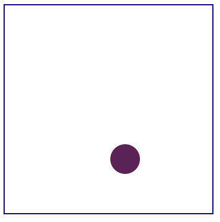

# Name: BounceBall

## Description: 
BounceBall is a project to demonstrate my JavaScript & html skills. In this project, the ball bounces and changes direction at the boundaries. You will also notice the ball changing color when it hits a border. 

## Installation: 
1. Download the project to your desktop. If zipped, unzip it. 
2. Open index.html file in a browser to see the bouncing of the ball. 

## Usage: 
Use this project to play with JavaScript features and to improve your html skills.

## Support: 
There are many support portals available for JavaScript like MDN, StackOverflow, etc. You can use this forum to research various styles and ask questions.

## Roadmap: 
The future of this project is to create balls as the user clicks inside the box and bounce them. 

## License information: 

See MIT license release in repository.
